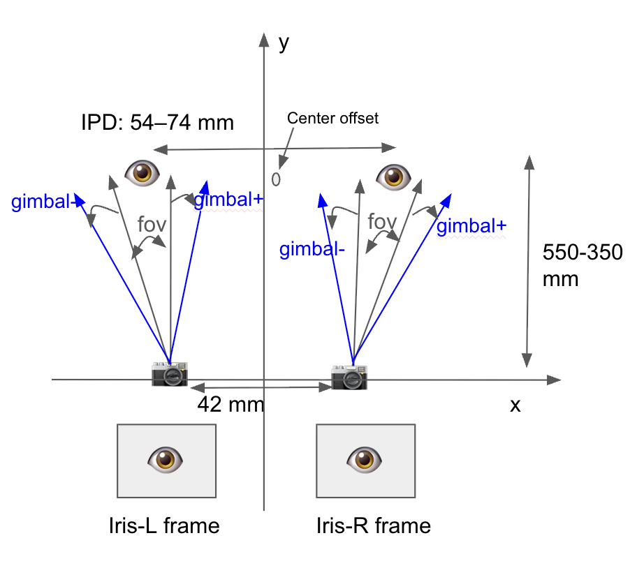

# Iris FOV Coverage Calculator

A GUI tool to calculate whether a camera's field of view adequately covers the iris/eyeball for a given optical system geometry, accounting for camera placement, interpupillary distance, and gimbal range.

---

## System Diagram



The diagram shows the top-down geometry: two cameras sit at the origin plane, and the two eyes are positioned at a distance above them. The calculator determines how much of the camera FOV is consumed by the eyeball angular subtense, and how much margin remains — both with and without gimbal compensation.

---

## Input Parameters

| Parameter | Unit | Default | Notes |
|---|---|---|---|
| **IPD** (Inter-Pupillary Distance) | mm | 63 | Distance between the centres of the two pupils. Normal human range: 54–74 mm. |
| **Eyeball Radius** | mm | 12 | Physical radius of the eyeball. Standard anatomical value ~12 mm. |
| **Eye-to-Camera Distance** | mm | 350 | Distance along the optical axis from the camera plane to the eye plane. Typical range: 350–550 mm. |
| **Eye–Camera Center Offset** | mm | 0 | Lateral offset between the eye centre line and the camera centre line. Zero means the camera pair is centred on the IPD midpoint. |
| **Camera Separation (L→R)** | mm | 42 | Centre-to-centre distance between the left and right cameras. System spec: **42 mm**. |
| **Camera Horizontal FOV** | ° | 5.6 | Horizontal angular field of view of each camera. System spec: **5.6°**. |
| **Gimbal Angle (one side)** | ° | 4 | One-sided angular range of the gimbal actuator. Effective because the prism doubles the mechanical angle (2× reflection). System spec: **4°**. |

---

## Output Results

| Output | Description |
|---|---|
| **Eye Coverage** | Angular subtense of the eyeball as seen from the camera (degrees). |
| **FOV Margin** | Remaining camera FOV after subtracting eye coverage (`camera_h_fov − eye_coverage`). Reported as **two-sided** margin. |
| **FOV Margin + Gimbal** | FOV margin plus the gimbal angle, representing the usable one-sided tracking range. |

Results are colour-coded: **green** = comfortable margin, **yellow** = tight (< 1°), **red** = insufficient (negative).

---

## Installation

### Requirements

- Python 3.8+
- `Pillow` (for image display in the GUI)
- `tkinter` (bundled with Python on most platforms; see note below)

### Setup

```bash
# 1. Create and activate a virtual environment
python3 -m venv misc_env
source misc_env/bin/activate        # macOS / Linux
misc_env\Scripts\activate           # Windows

# 2. Install dependencies
pip install Pillow
```

### tkinter on macOS (Homebrew Python)

If you see `ModuleNotFoundError: No module named '_tkinter'`, install the Tk bindings for your Python version:

```bash
brew install python-tk@3.14   # replace 3.14 with your python3 --version
```

### Run

```bash
source misc_env/bin/activate
python3 iris_fov_coverage_gui.py
```

Or run the headless script directly (prints results to terminal):

```bash
python3 iris_fov_coverage_calculator.py
```
